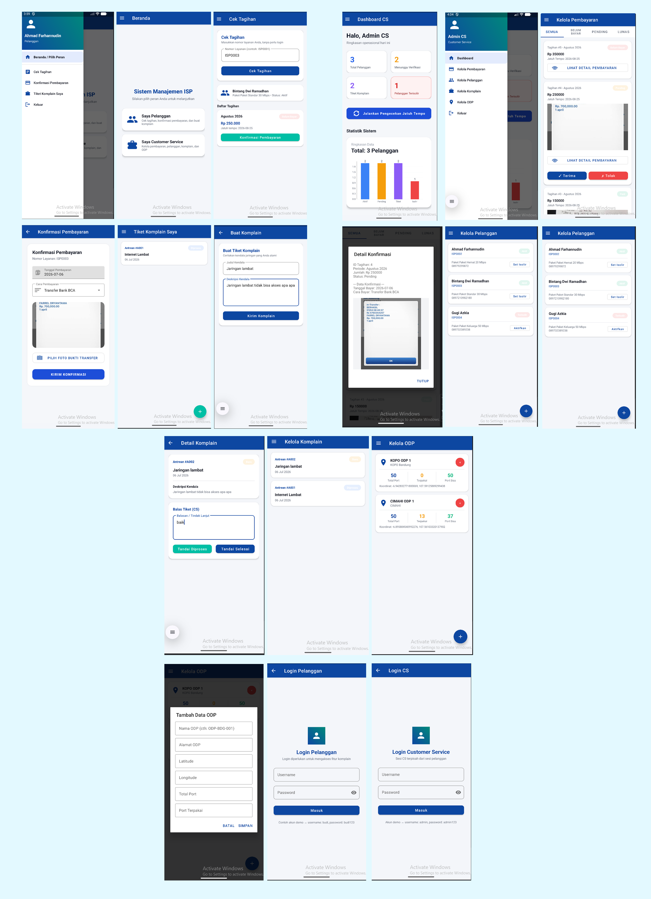

# UAS-kelompok-2-Pemograman-Mobile-1

Ahmad Farhanudin 24552011295
Bintang Dwi Ramadhan 24552011305
Gugi Azkia Fikri Lauda 


# 📡 ISP Management App

<p align="center">
  
  
  
  
  
</p>

<p align="center">
  Aplikasi Android untuk manajemen layanan Internet Service Provider (ISP) berbasis Kotlin dengan arsitektur MVVM dan database Room SQLite.
</p>

---

## 📋 Deskripsi Aplikasi

**ISP Management App** adalah aplikasi manajemen layanan internet yang dirancang untuk memudahkan operasional perusahaan ISP skala kecil hingga menengah. Aplikasi ini menghubungkan dua peran utama — **Pelanggan** dan **Customer Service (CS)** — dalam satu platform mobile yang terintegrasi.

Pelanggan dapat mengecek tagihan, melakukan konfirmasi pembayaran manual dengan mengunggah bukti transfer, serta membuat dan memantau tiket gangguan jaringan. Di sisi lain, tim CS dapat memverifikasi pembayaran, mengelola data pelanggan, merespons komplain, serta mencatat infrastruktur jaringan (ODP) langsung dari smartphone.

Seluruh data disimpan secara lokal menggunakan **Room Database (SQLite)**, sehingga aplikasi dapat berjalan tanpa koneksi internet untuk sebagian besar fiturnya.

---

## 🏢 Tentang

Aplikasi ini dikembangkan sebagai solusi manajemen operasional untuk perusahaan ISP lokal yang membutuhkan sistem pencatatan tagihan, penanganan komplain pelanggan, dan manajemen infrastruktur jaringan yang sederhana namun fungsional.

Proyek ini dibuat sebagai bagian dari mata kuliah **Pemrograman Mobile** Semester 4, dengan tujuan mengimplementasikan konsep pengembangan aplikasi Android menggunakan:
- Arsitektur **MVVM** (Model-View-ViewModel)
- **Navigation Component** untuk navigasi antar layar
- **Room Database** sebagai solusi persistensi data lokal
- **Material Design 3** untuk antarmuka yang modern dan konsisten

---
## 📸 Screenshot

<div align="center">
  
</div>

## ✨ Fitur Utama

### 👤 Sisi Pelanggan
| Fitur | Keterangan |
|---|---|
| ✅ Cek Tagihan | Cek tagihan hanya dengan Nomor Layanan, **tanpa perlu login** |
| ✅ Konfirmasi Pembayaran | Upload foto bukti transfer, sistem menyimpan dengan status *Pending* |
| ✅ Tiket Komplain | Buat laporan gangguan, dapatkan nomor antrean otomatis |
| ✅ Lacak Status Tiket | Pantau balasan CS dan status penanganan komplain |

### 🖥️ Sisi Customer Service / Admin
| Fitur | Keterangan |
|---|---|
| ✅ Dashboard Ringkasan | Statistik real-time: pelanggan, tagihan pending, tiket, isolir |
| ✅ Verifikasi Pembayaran | Cek bukti transfer, terima atau tolak dengan catatan |
| ✅ Registrasi Pelanggan | Form lengkap pendaftaran pelanggan baru beserta tagihan pertama otomatis |
| ✅ Manajemen Status | Set pelanggan Aktif / Terisolir, cek jatuh tempo otomatis >30 hari |
| ✅ Balas Tiket Komplain | Respons tiket pelanggan, ubah status ke Diproses / Selesai |
| ✅ Kelola Data ODP | Catat titik ODP: koordinat, total port, port terpakai |

### 🔐 Sistem Login
- **Satu pintu login** untuk semua pengguna
- Deteksi level otomatis: sistem mengenali apakah akun adalah CS/Admin atau Pelanggan
- Sesi CS dan Pelanggan dikelola secara terpisah dan aman

---

## 🛠️ Teknologi yang Digunakan

| Komponen | Teknologi |
|---|---|
| Bahasa | Kotlin 2.0.21 |
| UI Framework | Material Design 3 (Material Components 1.12) |
| Arsitektur | MVVM (ViewModel + LiveData + Repository) |
| Navigasi | Navigation Component 2.8.9 |
| Database | Room 2.6.1 (SQLite) |
| Async | Kotlin Coroutines 1.9.0 |
| Gambar | Glide 4.16.0 |
| Sesi Login | SharedPreferences |
| Min SDK | API 24 (Android 7.0 Nougat) |
| Target SDK | API 35 (Android 15) |

---

## 🗄️ Struktur Database

```
📦 isp_management.db
├── 👤 pelanggan       — Data identitas, paket, status layanan, akun login
├── 🧾 tagihan         — Tagihan per periode, jatuh tempo, status pembayaran
├── 💳 konfirmasi_pembayaran — Bukti transfer diunggah pelanggan
├── 🎫 tiket_komplain  — Tiket gangguan + balasan CS
├── 📡 odp             — Data titik ODP: koordinat & kapasitas port
└── 🔑 cs_user         — Akun login Customer Service
```

---

## 📁 Struktur Proyek

```
IspManagementApp/
├── app/src/main/
│   ├── AndroidManifest.xml
│   ├── java/com/ispmanagement/app/
│   │   ├── MainActivity.kt              ← Sidebar + navigasi utama
│   │   ├── data/
│   │   │   ├── Entities.kt              ← 6 Room Entity
│   │   │   ├── Daos.kt                  ← 6 Room DAO
│   │   │   ├── AppDatabase.kt           ← Room Database + seed data
│   │   │   ├── Repository.kt            ← Satu pintu akses data
│   │   │   └── SessionManager.kt        ← Manajemen sesi login
│   │   ├── viewmodel/
│   │   │   └── AppViewModel.kt          ← ViewModel tunggal bersama
│   │   └── ui/
│   │       ├── LoginFragment.kt         ← Login terpadu (deteksi level)
│   │       ├── adapters/                ← 5 RecyclerView Adapter
│   │       ├── customer/                ← Fragment sisi Pelanggan
│   │       └── cs/                      ← Fragment sisi CS/Admin
│   └── res/
│       ├── layout/                      ← File layout XML
│       ├── drawable/                    ← Ikon vektor & shape
│       ├── navigation/nav_graph.xml     ← Graph navigasi
│       └── values/                      ← Colors, Themes, Strings
```

---

## 🚀 Cara Instalasi & Menjalankan

### Prasyarat
- Android Studio **Panda 2025.3.2** atau lebih baru
- Android SDK API 35
- JDK 17
- Koneksi internet (untuk download Gradle dependencies pertama kali)

### Langkah-langkah

**1. Clone Repository**
```bash
git clone https://github.com/username/IspManagementApp.git
cd IspManagementApp
```

**2. Buka di Android Studio**
```
File → Open → Pilih folder IspManagementApp → OK
```

**3. Tunggu Gradle Sync selesai**
> Proses ini membutuhkan koneksi internet untuk mengunduh dependencies (±2–5 menit).

**4. Jalankan Aplikasi**
- **Emulator:** Buat Virtual Device (Pixel 6, API 34) via Device Manager, lalu klik ▶️ Run
- **HP Fisik:** Aktifkan USB Debugging, sambungkan via USB, pilih perangkat di dropdown

---

## 🔑 Akun Demo (Seed Data Otomatis)

Akun berikut **otomatis tersedia** saat pertama kali aplikasi diinstall:

| Peran | Username | Password | Keterangan |
|---|---|---|---|
| Customer Service | `admin` | `admin123` | Akses penuh ke semua fitur CS |
| Pelanggan | `budi` | `budi123` | Akun demo pelanggan |
| Nomor Layanan | `ISP0001` | — | Untuk cek tagihan tanpa login |

> **Catatan:** Data demo mencakup 2 tagihan contoh untuk pelanggan Budi Santoso.

---

## 📱 Cara Menggunakan Aplikasi

### Sebagai Pelanggan

#### 1. Cek Tagihan (Tanpa Login)
```
Buka Aplikasi
  → Halaman utama sudah langsung menampilkan form Cek Tagihan
  → Masukkan Nomor Layanan (contoh: ISP0001)
  → Klik "Cek Tagihan"
  → Daftar tagihan tampil beserta status pembayaran
```

#### 2. Konfirmasi Pembayaran
```
Dari daftar tagihan
  → Klik "Konfirmasi Pembayaran" pada tagihan "Belum Bayar"
  → Isi tanggal pembayaran (klik field untuk DatePicker)
  → Pilih cara pembayaran (Transfer ATM / M-Banking / Teller)
  → Klik "Pilih Foto Bukti Transfer" → pilih dari galeri
  → Klik "Kirim Konfirmasi"
  → Status tagihan berubah menjadi "Pending" ✅
```

#### 3. Login & Buat Tiket Komplain
```
Buka Sidebar (klik ikon ☰ kiri atas)
  → Pilih "Masuk / Login"
  → Masukkan username & password pelanggan
    pelanggan username : budi | password : budi123
  → Sistem otomatis mendeteksi level → diarahkan ke menu Komplain
  → Klik tombol "+" untuk buat tiket baru
  → Isi judul dan deskripsi kendala
  → Kirim → Nomor antrean otomatis terbuat (A001, A002, dst.)
```

---

### Sebagai Customer Service

#### 1. Login CS/pelanggan
```
Buka Sidebar (klik ikon ☰ kiri atas)
  → Pilih "Masuk / Login"
  → Masukkan username & password CS =
    CS = username : admin | password : admin123
  → Sistem mendeteksi level CS → diarahkan ke Dashboard
```

#### 2. Verifikasi Pembayaran
```
Sidebar → "Kelola Pembayaran"
  → Tab "Pending" untuk melihat konfirmasi yang masuk
  → Lihat foto bukti transfer pelanggan
  → Klik "✓ Terima" jika dana sudah masuk → status berubah "Paid"
  → Klik "✗ Tolak" + isi alasan jika bukti tidak valid
```

#### 3. Registrasi Pelanggan Baru
```
Sidebar → "Kelola Pelanggan" → Klik tombol "+"
  → Isi form: Nama, Alamat, HP, Paket, Harga, Nomor Layanan
  → Isi akun login: Username & Password untuk pelanggan
  → Klik "Simpan Data Pelanggan"
  → Tagihan bulan pertama otomatis dibuat ✅
```

#### 4. Pengecekan Jatuh Tempo Otomatis
```
Dashboard CS
  → Klik "Jalankan Pengecekan Jatuh Tempo (> 30 hari)"
  → Sistem otomatis mengubah status pelanggan yang menunggak
    menjadi "Terisolir" di database
  → Pemutusan jaringan fisik dilakukan manual oleh teknisi
```

#### 5. Balas Tiket Komplain
```
Sidebar → "Kelola Komplain"
  → Klik tiket yang ingin dibalas
  → Tulis balasan / tindak lanjut
  → Klik "Tandai Diproses" atau "Tandai Selesai"
```

#### 6. Kelola ODP
```
Sidebar → "Kelola ODP" → Klik tombol "+"
  → Isi: Nama ODP, Alamat, Koordinat (Lat/Long), Total Port, Port Terpakai
  → Simpan → Data ODP tersimpan untuk referensi lapangan
```

---


## ⚠️ batasan sistem

- Aplikasi ini **tidak terhubung ke Mikrotik** — pemutusan/penyambungan internet fisik dilakukan manual oleh teknisi di luar sistem
- Tidak terhubung ke payment gateway
- Semua data tersimpan **lokal di perangkat** (Room SQLite), tidak ada backend server
- Foto bukti transfer tersimpan di **penyimpanan internal** aplikasi
- Jika aplikasi di-uninstall, **semua data akan terhapus**

---


## 📄 Lisensi

Proyek ini menggunakan lisensi [MIT](LICENSE).

---

<p align="center">
  Dibuat dengan ❤️ menggunakan Kotlin & Android Studio
</p>
